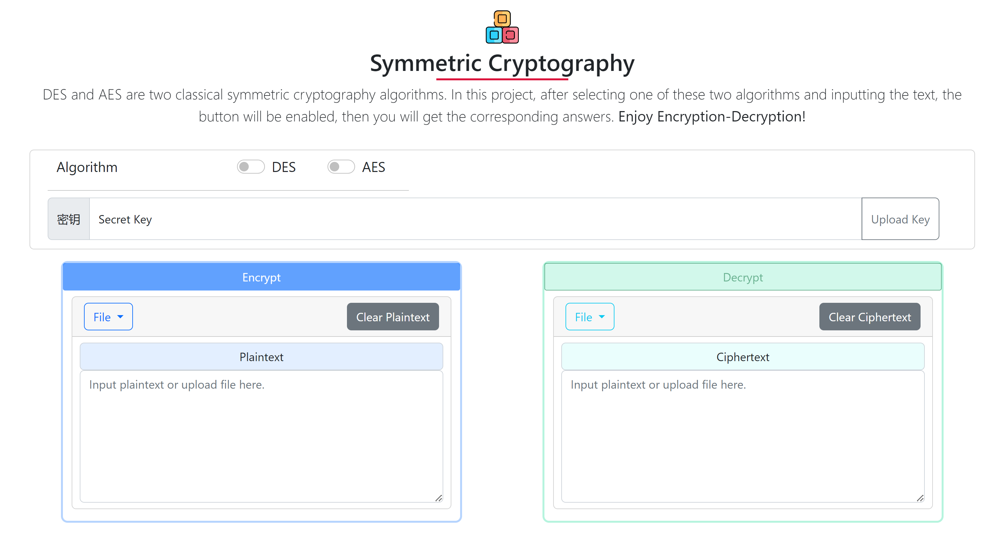

# Symmetric Cryptography: DES & AES Encryption-Decryption Tool 🛡️

## Introduction 📖

This project, developed for our Introduction to Information Security course, showcases a web-based tool that facilitates encryption and decryption using two seminal symmetric cryptography algorithms: DES (Data Encryption Standard) and AES (Advanced Encryption Standard). This application provides an interactive and intuitive interface, enabling users to engage with the core principles of these encryption methods.

## Features ✨

- **Encryption & Decryption** 🔐: Offers the choice of using either DES or AES algorithms for the encryption and decryption of text.
- **Text Input & File Upload** 📄: Accommodates both direct plaintext entry and file uploads for processing.
- **Interactive Interface** 💻: Features a dynamic and responsive interface that becomes interactive upon algorithm selection and input.
- **Flask Backend** ⚙️: Employs Flask, a lightweight yet robust web framework, for implementing cryptographic algorithms.
- **Bootstrap Frontend** 🎨: The user interface is designed with Bootstrap, ensuring a responsive layout and an aesthetically appealing experience.

## Live Project 🌐

Experience our Symmetric Cryptography tool live: [Visit Here](https://symmetric-cryptography-imt1dj224-zzz212zzz.vercel.app)

## Demo Video 🎥

Watch our demo on Bilibili: [Watch Demo](https://www.bilibili.com/video/BV1FG4y1d7gP/?t=4&spm_id_from=333.1350.jump_directly)
